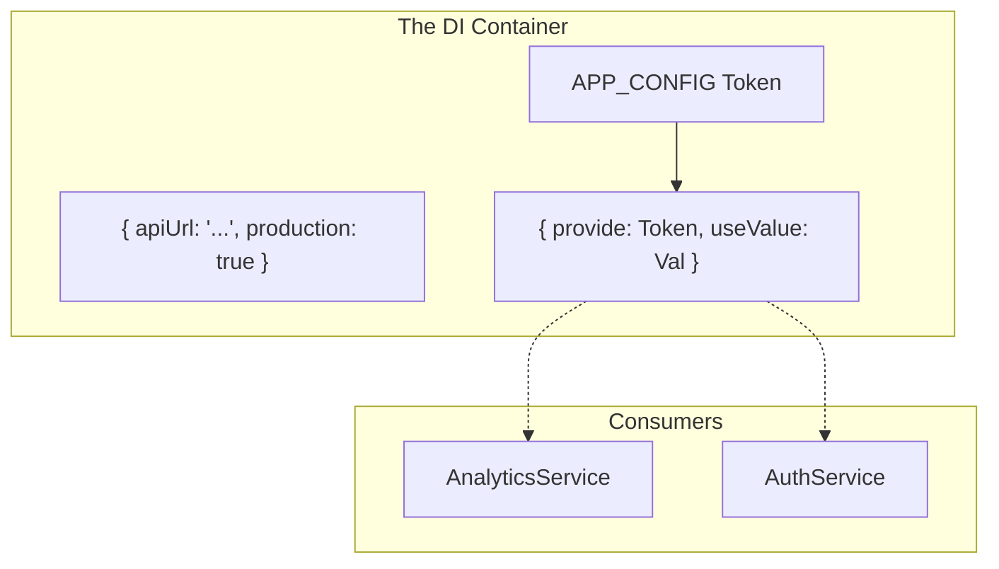

+++
date = '2026-02-15T14:52:37+02:00'
authors = ["Kostas"]
draft = false
title = "Angular Enterprise Dashboard - Phase 1: Building a Resilient Core with Dependency Injection"
tags = ["angular", "architecture", "dependency-injection", "zoneless", "tutorial"]
categories = ["Angular Engineering"]
lightgallery = true
images = ["/images/2026/angular-3-logo-png-transparent.png"]
featuredImage = "images/2026/angular-3-logo-png-transparent.png"
series = ["angular-enterprise-board"]
+++

Welcome to the second post in our series. In the [Introduction](/blog/introduction), we talked about the vision. Now, it's time to get our hands dirty. **Phase 1** was all about the foundation—the invisible plumbing that makes a professional application robust or brittle.

<!--more-->

# The Foundation: Why Architecture Matters

Today, we're dissecting the core architecture of our dashboard, focusing on one of Angular's most powerful (and often misunderstood) tools: **Dependency Injection (DI)**.

---

## 🚀 Going Zoneless

Before we dive into DI, let's talk about performance. Our first major architectural decision was to go **Zoneless**.

In traditional Angular, `Zone.js` monkey-patches the browser to detect when "something happened" and triggers change detection. In this project, we explicitly opt-out:

```typescript
// app.config.ts
export const appConfig: ApplicationConfig = {
  providers: [
    provideZonelessChangeDetection(),
    // ...
  ],
};
```

**The Teaching Moment:** Why? Eliminating Zone.js reduces initial bundle size and makes change detection more predictable and performant. It forces us to use **Signals**, ensuring that only the parts of the DOM that actually need updating are touched.

---

## 🛠️ The Power of InjectionTokens

In many apps, you might see configuration passed around like this:
`const API_URL = 'http://localhost:3000';` (Brittle! Hard to test!)

In an enterprise setting, we treat configuration as a **dependency**. This is where `InjectionToken` shines.

### What problem does it solve?

Imagine you have multiple services that need the same API configuration. If you import a constant, you've created a hard dependency. You can't easily swap that constant for a different value during unit tests or for different environments without modifying the code itself.

By using an `InjectionToken`, we decouple the _need_ for a value from the _value itself_.



### Implementation in the Wild

In our project, we define our tokens in `core/tokens/app-config.token.ts`:

```typescript
export interface AppConfig {
  apiUrl: string;
  production: boolean;
}

export const APP_CONFIG = new InjectionToken<AppConfig>("APP_CONFIG");
```

And we provide the value at the application root:

```typescript
// app.config.ts
provideAppConfig({
  apiUrl: 'https://api.dashboard.enterprise.com',
  production: true
}),
```

---

## 🏗️ Dynamic Provider Strategies

DI isn't just for constants; it's for **behavior**. One of the "pro" patterns we used in Phase 1 is the conditional provider for our `LoggerService`.

```typescript
{
  provide: LoggerService,
  useClass: environment.production ? ProductionLoggerService : ConsoleLoggerService
}
```

**Why this is cool:** Our components just `inject(LoggerService)`. They don't know (or care) if they are talking to a console logger or an enterprise-grade Splunk reporter. We can swap the implementation globally at the config level without touching a single component.

---

## 🔒 Functional Interceptors

Finally, we've moved away from Class-based interceptors to the modern **Functional** approach. These are lighter, easier to compose, and work perfectly with our DI system.

```typescript
export const authInterceptor: HttpInterceptorFn = (req, next) => {
  const config = inject(APP_CONFIG); // We can STILL use DI here!
  // ... wrap request
  return next(req);
};
```

## Wrapping Up Phase 1

By the end of Phase 1, we have a "shell" that is optimized for performance (Zoneless), highly configurable through `InjectionTokens`, and resilient thanks to a global error handling strategy.

**Next up:** Phase 2, where we tackle Security, functional guards, and our first premium UI components with glassmorphism.
