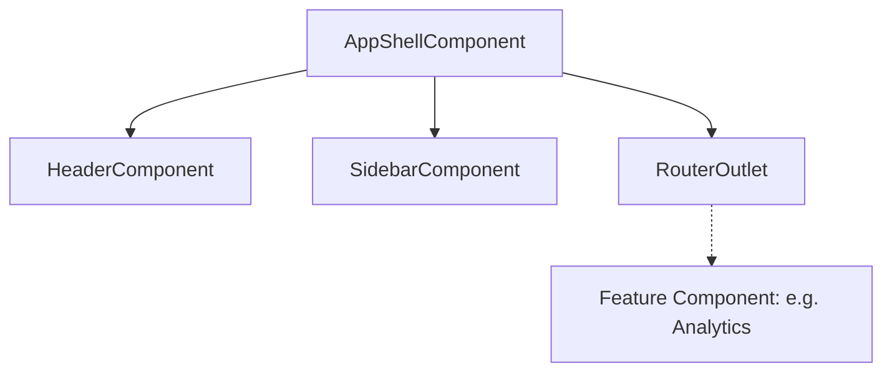

+++
date = '2026-02-16T22:00:00+02:00'
authors = ["Kostas"]
draft = false
title = "Angular Enterprise Dashboard - Phase 2.3: Architecture of the Shell - Building a Premium Layout"
tags = ["angular", "architecture", "layout", "app-shell", "components"]
categories = ["Angular Engineering"]
lightgallery = true
images = ["/images/2026/angular-3-logo-png-transparent.png"]
featuredImage = "images/2026/angular-3-logo-png-transparent.png"
series = ["angular-enterprise-board"]
+++

Designing an enterprise application requires more than just functional code; it requires a scalable structure. In **Phase 2.3**, we implemented the **App Shell**, the architectural skeleton that hosts our entire dashboard experience.

<!--more-->

# The App Shell: More Than a Wrapper

In this post, we’ll look at how we organized our layout into atomic, maintainable components.

---

## 🏗️ The Container Pattern

We used the **Container/Presentational** pattern for our shell. The `AppShellComponent` acts as the orchestrator, while `Header` and `Sidebar` focus on specific UI areas.

```typescript
// app-shell.component.ts
@Component({
  selector: "app-shell",
  template: `
    <div class="app-shell">
      <app-sidebar class="sidebar" />
      <div class="main-container">
        <app-header />
        <main class="content">
          <router-outlet />
          <!-- Your feature components load here -->
        </main>
      </div>
    </div>
  `,
  // ...
})
export class AppShellComponent {}
```

---

## 🧩 Component Composition

Our layout is a perfect example of component composition. By separating the Sidebar and Header, we can manage their internal state and lifecycle independently of the main dashboard content.



---

## 📐 Enterprise-Grade Grid & Flex

A premium feel starts with consistency. We used a combination of Flexbox and CSS Grid to ensure our layout is both responsive and rigid where it needs to be.

```css
.app-shell {
  display: flex;
  width: 100%;
  min-height: 100vh;
}

.sidebar {
  width: var(--sidebar-width); /* Consistent 280px */
  flex-shrink: 0;
}

.main-container {
  flex: 1;
  display: flex;
  flex-direction: column;
}
```

---

## 🎓 The Teaching Moment: OnPush Change Detection

Every component in our layout uses `ChangeDetectionStrategy.OnPush`.

**Why?** In a large dashboard with real-time data, we don't want Angular checking the entire component tree every time a single notification arrives. Combined with **Signals**, `OnPush` ensures that the shell components only re-render when their specific inputs or internal signals change.

---

## 🚀 Scaling the Layout

This shell architecture is designed to scale. Whether we add a bottom navigation bar for mobile or a right-side "Activity Feed," the `AppShellComponent` provides the central anchor for all our UI evolution.

## Coming Up Next

Structure is the skeleton, but the "Wow" factor comes from the skin. In **Phase 2.4: The "Wow" Factor**, we’ll look at how we used CSS Custom Properties and Glassmorphism to give this shell a premium, modern aesthetic.

---

_Found this architecture series insightful? The best way to learn is by doing. Explore the `src/app/core/layout` directory on GitHub to see the patterns in action!_
