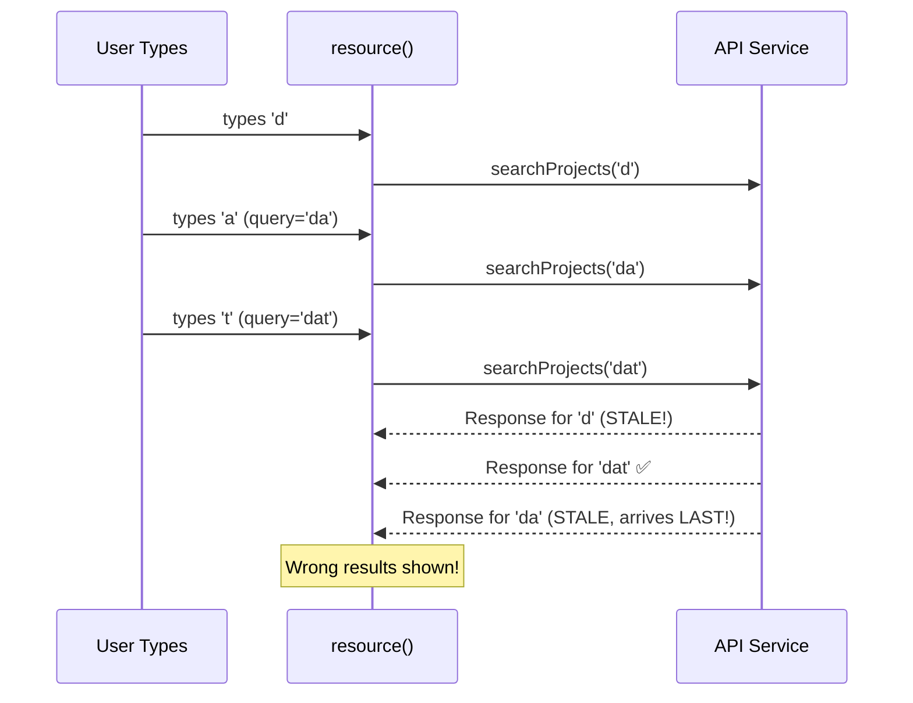
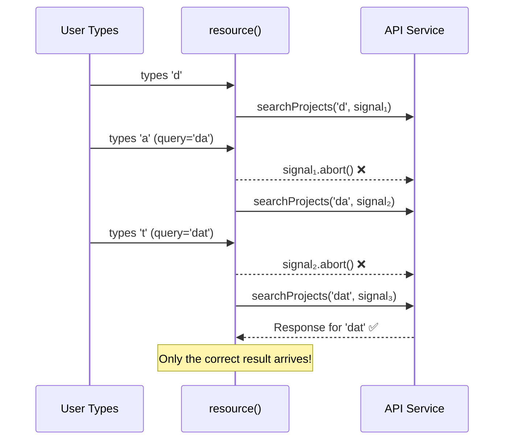
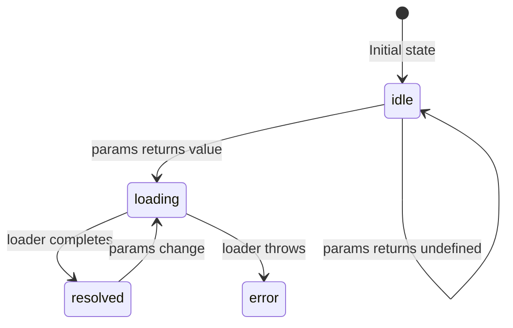

+++
date = '2026-03-01T10:20:00+02:00'
authors = ["Kostas"]
draft = false
title = "Angular Enterprise Dashboard - Phase 3B.2: Search-as-You-Type — Abort & Cancellation Patterns"
tags = ["angular", "resource-api", "abort-signal", "cancellation", "performance"]
categories = ["Angular Engineering"]
lightgallery = true
images = ["/images/2026/angular-3-logo-png-transparent.png"]
featuredImage = "images/2026/angular-3-logo-png-transparent.png"
series = ["angular-enterprise-board"]
+++

In the [previous post](/2026-03-18-phase-03b-part-01), we declared our `resource()` with a `params` computation and a `loader`. The user types a query, and the resource fetches matching projects.

<!--more-->

# The Art of Cancelling Work You No Longer Need

But what happens when the user types _fast_? Each keystroke changes the `searchQuery` signal, which changes `params`, which triggers a new `loader` call. Without proper handling, you'd have multiple overlapping requests — a recipe for race conditions, wasted bandwidth, and stale data.

This is where **`abortSignal`** saves the day.

---

## 🧠 The Problem: Race Conditions

Imagine the user types "dat" quickly:

- Keystroke 'd' → Request 1 starts
- Keystroke 'a' → Request 2 starts (Request 1 is now stale)
- Keystroke 't' → Request 3 starts (Request 2 is also stale)

Without cancellation, all three requests complete. The last one to resolve "wins" — but network timing is unpredictable. Request 1 (for 'd') might resolve _after_ Request 3 (for 'dat'), showing the wrong results.

### Without Abort



### With Abort



---

## 🔧 How Angular Handles It

When `params` changes, Angular's `resource()` **automatically creates a new `AbortSignal`** and fires the old one before invoking the new loader. You don't need to manage this yourself — just pass the signal through.

```typescript
readonly projectsResource = resource({
  params: () => {
    const query = this.searchQuery();
    return query.length > 0 ? { query } : undefined;
  },

  loader: async ({ params, abortSignal }) => {
    // abortSignal is auto-cancelled when params change
    return this.projectApi.searchProjects(params.query, abortSignal);
  },
});
```

---

## 🛠️ Building an AbortSignal-Aware Service

The API service must _respect_ the signal. Here's our `delay()` helper that properly cleans up:

```typescript
private delay(ms: number, abortSignal?: AbortSignal): Promise<void> {
  return new Promise((resolve, reject) => {
    const timer = setTimeout(resolve, ms);
    abortSignal?.addEventListener('abort', () => {
      clearTimeout(timer);
      reject(new DOMException('Request aborted', 'AbortError'));
    });
  });
}
```

**Key detail:** The `DOMException` with name `'AbortError'` is the standard signal for fetch cancellation. Angular's `resource()` recognizes this and doesn't treat it as a failure — it simply discards the result.

In a real production app using `fetch()`, you'd just pass the signal directly:

```typescript
// Production version
const response = await fetch(url, { signal: abortSignal });
```

---

## 🟡 The `idle` State: Doing Nothing on Purpose

Notice this line in our `params` computation:

```typescript
return query.length > 0 ? { query } : undefined;
```

When `params` returns `undefined`, the resource enters the **`idle`** state. The loader is **not called**. This is intentional — an empty search box means "the user hasn't asked for anything yet."



In our template, we handle this with an inviting empty state:

```html
@case ('idle') {
<div class="empty-state">
  <span class="empty-icon">🔍</span>
  <p>Type a search query to find projects.</p>
</div>
}
```

---

## 🎓 The Teaching Moment: Signal Updates Drive Everything

The entire search flow is triggered by a single signal update:

```typescript
onSearchInput(event: Event): void {
  const value = (event.target as HTMLInputElement).value;
  this.searchQuery.set(value); // This one line triggers everything
}
```

1. `searchQuery` updates → `params` re-evaluates → old request aborted → new loader runs → `status` and `value` signals update → template re-renders.

No `debounceTime`. No `switchMap`. No `takeUntilDestroyed`. Just Signals.

---

## Coming Up Next

We've handled the data lifecycle and cancellation. But how does the UI _look_ during each phase? In **Phase 3B.3**, we'll build a comprehensive status-driven UI that handles all six `ResourceStatus` states.

---

_Try typing fast in the search box and watch the browser DevTools network tab. You'll see cancelled requests — that's `abortSignal` at work!_
