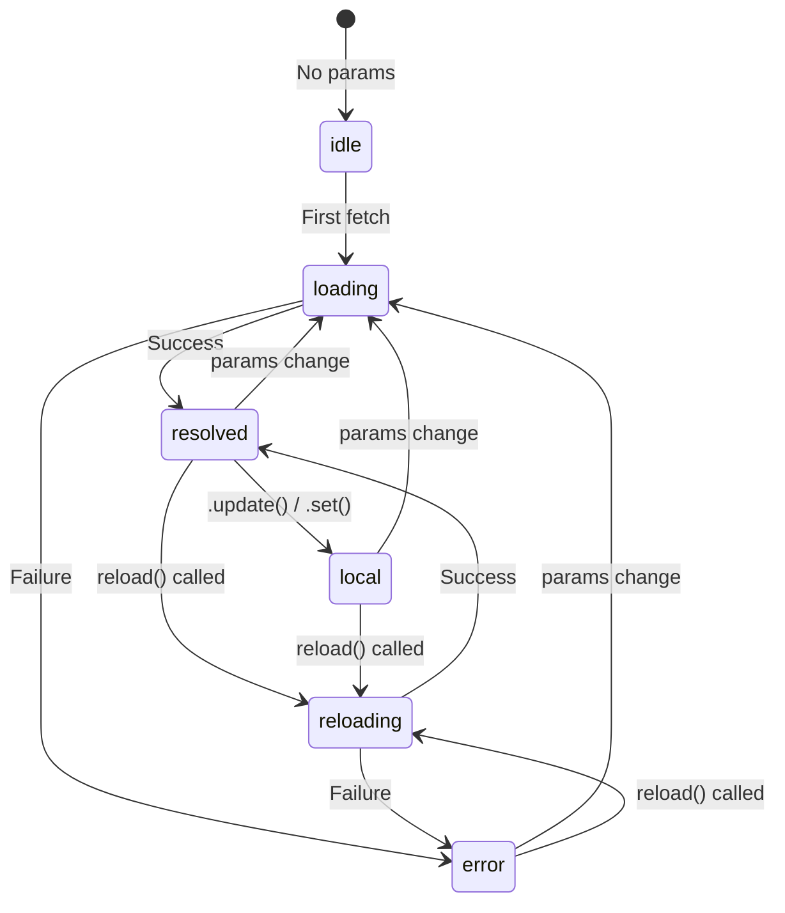

+++
date = '2026-03-01T10:22:00+02:00'
authors = ["Kostas"]
draft = false
title = "Angular Enterprise Dashboard - Phase 3B.3: Six States of Data — ResourceStatus & the UI"
tags = ["angular", "resource-api", "ui-states", "skeleton-loading", "tutorial"]
categories = ["Angular Engineering"]
lightgallery = true
images = ["/images/2026/angular-3-logo-png-transparent.png"]
featuredImage = "images/2026/angular-3-logo-png-transparent.png"
series = ["angular-enterprise-board"]
+++

Most applications handle two data states: "loading" and "loaded." Maybe three if they remember errors. But in a real enterprise dashboard, there are **six** distinct states — and handling each explicitly is the difference between a polished product and a buggy one.

<!--more-->

# Every Async Operation Has Six Faces

In this post, we'll build a UI that correctly responds to every `ResourceStatus` value.

---

## 📊 The Six States

Angular's `resource()` exposes a `status()` signal with these possible values:



| Status      | Meaning                                          | UI Treatment         |
| ----------- | ------------------------------------------------ | -------------------- |
| `idle`      | No request pending (params returned `undefined`) | Welcome message      |
| `loading`   | First fetch in progress                          | Shimmer skeleton     |
| `reloading` | Re-fetch after `reload()` — data still visible   | Overlay indicator    |
| `resolved`  | Data successfully loaded                         | Project cards        |
| `error`     | Loader threw an error                            | Error banner + Retry |
| `local`     | Data mutated locally via `.update()`             | Data + sync notice   |

---

## 🏗️ The Template: `@switch` Over Status

Our template uses Angular's `@switch` to render the appropriate UI for each state:

```html
@switch (projectsResource.status()) { @case ('idle') {
<div class="empty-state">
  <span class="empty-icon">🔍</span>
  <p>Type a search query to find projects.</p>
</div>
} @case ('loading') {
<div class="skeleton-grid">
  @for (i of skeletonItems; track i) {
  <div class="skeleton-card"></div>
  }
</div>
} @case ('error') {
<div class="error-banner">
  <span>❌ {{ getErrorMessage(projectsResource.error()) }}</span>
  <button (click)="handleReload()">Retry</button>
</div>
} @default {
<!-- resolved / reloading / local all show data -->
<div class="project-grid">
  @for (project of projectsResource.value(); track project.id) {
  <article class="project-card">...</article>
  } @empty {
  <div class="empty-state">📭 No projects match your search.</div>
  }
</div>
} }
```

**Why `@default`?** The `resolved`, `reloading`, and `local` states all have data to show. They differ in secondary treatment (overlay, notice), not in the core content. Grouping them under `@default` avoids duplication.

---

## 💀 Shimmer Skeletons: Loading Done Right

Instead of a spinner, we use **shimmer skeleton cards** that hint at the shape of the content:

```css
.skeleton-card {
  height: 200px;
  border-radius: var(--radius-lg, 16px);
  background: linear-gradient(90deg, #f1f5f9 25%, #e2e8f0 50%, #f1f5f9 75%);
  background-size: 200% 100%;
  animation: shimmer 1.5s infinite;
}

@keyframes shimmer {
  0% {
    background-position: 200% 0;
  }
  100% {
    background-position: -200% 0;
  }
}
```

**Why skeletons over spinners?** Skeletons reduce perceived loading time because they give the user a sense of the page's structure. Studies show users rate skeleton-loaded pages as 10-15% faster than spinner-loaded pages with identical real load times.

---

## 🔄 The `reload()` Pattern

Sometimes the user wants fresh data. Our "Reload" button calls `projectsResource.reload()`:

```typescript
handleReload(): void {
  this.projectsResource.reload();
}
```

When `reload()` is called:

- Status transitions from `resolved` → `reloading`
- The existing data **stays visible** (unlike `loading`, which clears it)
- The loader runs again with the same params
- On success, status returns to `resolved` with fresh data

We show a subtle overlay during reloading:

```html
@if (projectsResource.status() === 'reloading') {
<div class="reload-overlay">Refreshing...</div>
}
```

---

## 📛 The Status Badge

For educational purposes (and great UX), we show the current `ResourceStatus` as a colored pill:

```html
<span class="status-badge" [class]="'status-' + projectsResource.status()">
  {{ projectsResource.status() | uppercase }}
</span>
```

Each status gets its own color:

```css
.status-idle {
  background: #f1f5f9;
  color: #64748b;
}
.status-loading,
.status-reloading {
  background: #ede9fe;
  color: #7c3aed;
}
.status-resolved {
  background: #ecfdf5;
  color: #059669;
}
.status-error {
  background: #fef2f2;
  color: #dc2626;
}
.status-local {
  background: #fef3c7;
  color: #d97706;
}
```

---

## 🎓 The Teaching Moment: Status-Driven UI as a Pattern

This pattern isn't specific to Angular. Any async operation — in React, Vue, Svelte, or vanilla JS — goes through these states. The key principle is:

> **Never assume your data is "just there." Every async operation has a lifecycle, and every state deserves explicit UI treatment.**

The `resource()` API makes this easy because the status is a first-class signal. No more manual `isLoading` / `hasError` / `data` boolean juggling.

---

## Coming Up Next

We've handled all six states, but there's one more advanced pattern: **optimistic updates**. In **Phase 3B.4**, we'll see how `.update()` lets you modify data locally without re-fetching — and how the `'local'` status communicates this to the user.

---

_Open your browser DevTools and watch the status badge change as you search, reload, and interact. It's a real-time view of the resource lifecycle!_
