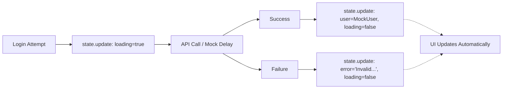

# Angular Enterprise Dashboard - Phase 2.1: Reactive Authentication with Angular Signals


Welcome to Phase 2 of our Enterprise Dashboard journey. Now that we have our foundation ([Phase 1](/blog/phase-01)), it's time to build the "brain" of our application's security: the **Authentication Service**.

<!--more-->

# Elevating State: Authentication in the Signal Era

In this post, we'll explore how to manage complex authentication states using **Angular Signals**—without the overhead of heavy state management libraries.

---

## 🧠 The Philosophy of Managed State

In an enterprise app, Authentication isn't just a boolean `isLoggedIn`. It's a spectrum of states: `Loading`, `Authenticated`, `Error`, and `Guest`.

Traditionally, we might have used multiple `BehaviorSubjects` or a complex NgRx Store. With Signals, we can achieve the same predictability with much less boilerplate.

### The Auth State Model

We start by defining a single source of truth: our `AuthState`.

```typescript
// user.model.ts
export interface AuthState {
  user: User | null;
  loading: boolean;
  error: string | null;
}
```

---

## 🏗️ Implementing the AuthService

Our `AuthService` encapsulates this state using a private Signal and exposes data through read-only **Computed Signals**. This ensures that the state can only be modified through service methods, like `login()` and `logout()`.

```typescript
@Injectable({ providedIn: "root" })
export class AuthService {
  // 1. Private State
  private readonly stateSig = signal<AuthState>({
    user: null,
    loading: false,
    error: null,
  });

  // 2. Public Selectors (Derived State)
  readonly user = computed(() => this.stateSig().user);
  readonly isAuthenticated = computed(() => !!this.stateSig().user);
  readonly isLoading = computed(() => this.stateSig().loading);
  readonly userRole = computed(
    () => this.stateSig().user?.role ?? UserRole.GUEST,
  );

  // ...
}
```

### State Management Flow

When a user logs in, we don't just set a variable. We update the state in a way that all "selectors" (computed signals) react immediately and efficiently.



---

## 🎓 The Teaching Moment: Why Computed?

You might wonder: _Why not just expose the state signal directly?_

Exposing `computed` values follows the **Principle of Least Privilege**. Components only see the specific slice of data they need, and they **cannot** accidentally mutate the state. This makes debugging a breeze—if the state is wrong, you only have one place to look: the `AuthService`.

```typescript
// Example usage in a component
readonly isAdmin = computed(() => this.authService.userRole() === UserRole.ADMIN);
```

---

## 🔒 Handling Roles

In an Enterprise Dashboard, users aren't created equal. We've integrated a robust `UserRole` system directly into our state. By having the `userRole` as a computed signal, we can easily build features like **Role-Based Access Control (RBAC)**—which we'll explore later in this series.

```typescript
hasRole(role: UserRole | UserRole[]): boolean {
  const userRole = this.userRole();
  if (Array.isArray(role)) {
    return role.includes(userRole);
  }
  return userRole === role;
}
```

## Coming Up Next

Managing state is only half the battle. How do we ensure users can't navigate to parts of the app they shouldn't see?

In our next post, we'll dive into **Phase 2.2: Functional Route Guards**, where we'll see these Signals in action protecting our application's perimeter.

---

_Found this useful? Every line of this dashboard is designed to be production-ready. Check out the full source code on GitHub!_

