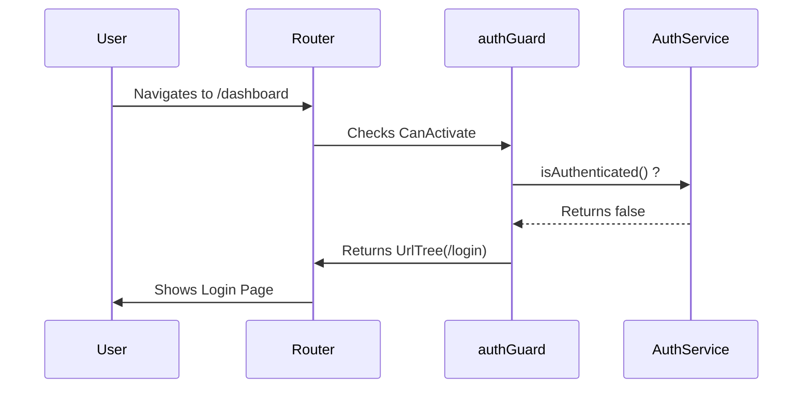

# Angular Enterprise Dashboard - Phase 2.2: Securing the Perimeter - Functional Route Guards


In the previous part of this series, we built our [Reactive Authentication Service](/blog/phase-02-part-01). Now, we need to bridge the gap between our authentication state and our application's navigation.

<!--more-->

# Security as a Function: Modernizing the Perimeter

Enter **Functional Route Guards**. In this post, we’ll see how to leverage Angular's modern functional patterns to protect our routes with minimal friction and maximum clarity.

---

## 🏗️ The Shift from Classes to Functions

Angular has evolved. The days of creating a class implementing `CanActivate` are behind us. Modern guards are just functions.

### Why go functional?

- **Lightweight**: No need for the boilerplate of a class and DI constructor.
- **Composable**: Functions are easier to combine and reason about.
- **DI-Friendly**: You can still use `inject()` to get any service you need.

---

## 🛡️ Protecting the Dashboard: authGuard

Our goal is simple: if a user is not authenticated, they shouldn't see the dashboard. Instead, they should be redirected to the login page.

```typescript
// auth.guard.ts
export const authGuard: CanActivateFn = () => {
  const authService = inject(AuthService);
  const router = inject(Router);

  if (authService.isAuthenticated()) {
    return true; // Proceed with navigation
  }

  // Redirect to login if not authenticated
  return router.createUrlTree(["/login"]);
};
```

### The Logic Flow



---

## 🚪 The Guest Guard: guestGuard

Security works both ways. We also want to prevent authenticated users from going back to the login page—it’s a better UX to keep them in their workspace.

```typescript
// guest.guard.ts
export const guestGuard: CanActivateFn = () => {
  const authService = inject(AuthService);
  const router = inject(Router);

  if (!authService.isAuthenticated()) {
    return true; // Guests are welcome!
  }

  return router.createUrlTree(["/dashboard"]);
};
```

---

## 🚦 Integrating into the Router

The real beauty of functional guards is how clean the route configuration becomes. You simply list them in the `canActivate` array.

```typescript
// app.routes.ts
export const routes: Routes = [
  {
    path: "login",
    loadComponent: () => import("./features/auth/login.component"),
    canActivate: [guestGuard], // Only for unauthenticated users
  },
  {
    path: "",
    canActivate: [authGuard], // The "Outer Wall"
    loadComponent: () => import("./core/layout/app-shell.component"),
    children: [
      {
        path: "dashboard",
        loadComponent: () => import("./features/dashboard.component"),
      },
    ],
  },
];
```

## 🎓 The Teaching Moment: Signals + Guards

Notice how our guards use `authService.isAuthenticated()`. Because this is a **Computed Signal**, it’s lightning-fast. The Router doesn't need to wait for an Observable to emit; it gets the truth immediately.

## Coming Up Next

We've secured our routes, but where do our users actually "live"? In **Phase 2.3: Architecture of the Shell**, we'll build the premium layout that hosts our dashboard features.

---

_Found this useful? This dashboard is designed to showcase enterprise patterns. Check out the series history in the [docs/blog](https://github.com/your-username/angular-enterprise-dashboard/tree/main/docs/blog) directory!_

