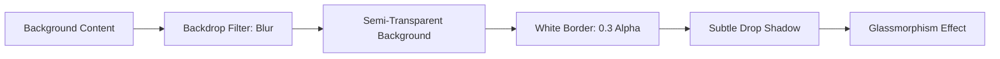

# Angular Enterprise Dashboard - Phase 2.4: The 'Wow' Factor - Glassmorphism and CSS Variables


Great design is often seen as "flavor," but in enterprise applications, it's about **usability** and **brand trust**. A premium, polished UI tells the user that the system is professional and reliable.

<!--more-->

# Aesthetics as an Engineering Discipline

In **Phase 2.4**, we focused on creating a design system based on **CSS Custom Properties** (Variables) and implementing high-end visual effects like **Glassmorphism**.

---

## 📐 Design Tokens: The Root of All Style

Instead of hardcoding colors and spacing, we defined a series of "tokens" in our `:root`. This approach allows for easy theme switching (Dark Mode!) and ensures pixel-perfect consistency across the app.

```css
/* styles.css */
:root {
  /* Dynamic Color Palette */
  --primary-500: #3b82f6;
  --surface-100: #f8fafc;
  --surface-900: #0f172a;

  /* Layout Constants */
  --sidebar-width: 280px;
  --header-height: 72px;
}
```

**The Teaching Moment:** Why use CSS Variables over SCSS variables? CSS variables are **runtime-dynamic**. You can change them via JavaScript (e.g., a theme switcher) without recompiling your stylesheets.

---

## 💎 Mastering Glassmorphism

Glassmorphism creates a sense of depth by using transparency and background blurs. It makes the UI feel light and modern. We encapsulated this effect into a reusable utility class.

```css
.glass {
  background: rgba(255, 255, 255, 0.7);
  backdrop-filter: blur(12px);
  border: 1px solid rgba(255, 255, 255, 0.3);
  box-shadow: 0 8px 32px 0 rgba(31, 38, 135, 0.07);
}
```

### The Anatomy of the Effect



---

## 🎨 Applying the Polish

We applied this `.glass` class to our `Sidebar` and `Header` components. By layering glass elements over our soft `--surface-100` background, we achieved a "frosted" aesthetic that distinguishes the navigation from the data-heavy dashboard content.

### Using Computed Styles with Signals

In our components, we can even bridge the gap between our **State** and our **Styles**.

```typescript
// sidebar.component.ts
readonly sidebarClass = computed(() => ({
  'sidebar-expanded': this.isExpanded(),
  'glass': true
}));
```

---

## 🚀 The Result

A UI that feels "alive." By centering our design around tokens and modern CSS effects, we’ve created a look that is both cutting-edge and mathematically consistent.

## Coming Up Next

We have the authentication state, the routes, the shell, and the aesthetics. But how do we selectively show features based on user roles? In our final Phase 2 post, **Phase 2.5: Role-Based Access Control**, we’ll build a custom directive to manage permission-based visibility elegantly.

---

_Is your project ready for a design upgrade? Check out the `src/styles.css` file in our repo to see the full list of design tokens we use!_

