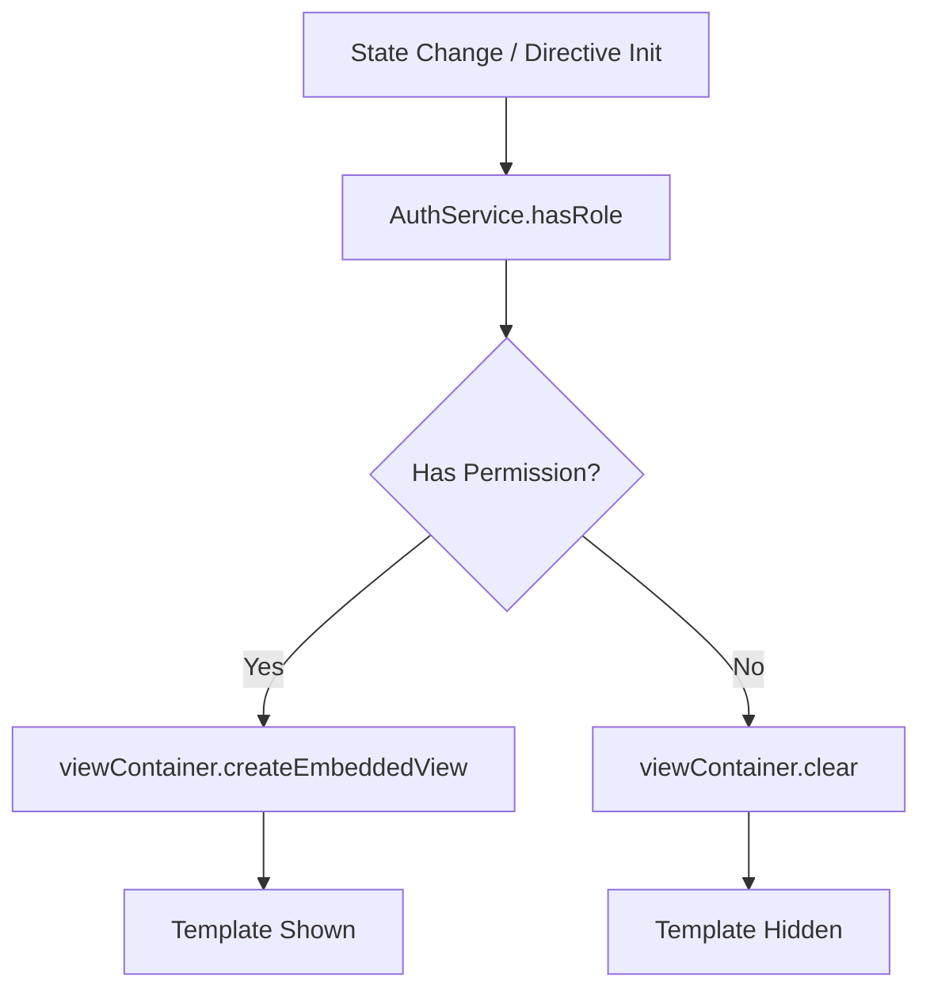

# Angular Enterprise Dashboard - Phase 2.5: Role-Based Access Control with Custom Directives


We’ve secured our routes with [Functional Guards](/blog/phase-02-part-02), but what about the UI itself? An Admin should see the "Delete" button, but a standard User should not.

<!--more-->

# Authorization Beyond the Route

In the final post of our Phase 2 series, we’ll implement **Role-Based Access Control (RBAC)** directly in our templates using a custom **Structural Directive**.

---

## 🏗️ The Goal: Clean Template logic

We want to be able to hide or show parts of our UI based on the user's role with a syntax as simple as this:

```html
<button *appHasRole="'ADMIN'" (click)="deleteEverything()">Danger Zone</button>
```

---

## 🛠️ Building the HasRoleDirective

A structural directive manages how a template is rendered. In our case, we want to render the template only if the user has the required role.

### The Secret Ingredient: Signals + Effects

Because our `AuthService` uses Signals, we can use an `effect` inside our directive. This means the UI will **automatically show or hide** elements if the user's role changes during their session (e.g., if their session expires or they log in as a different user).

```typescript
@Directive({ selector: "[appHasRole]", standalone: true })
export class HasRoleDirective {
  private readonly templateRef = inject(TemplateRef<unknown>);
  private readonly viewContainer = inject(ViewContainerRef);
  private readonly authService = inject(AuthService);

  @Input("appHasRole") roles: UserRole | UserRole[] = [];

  constructor() {
    effect(() => {
      // 1. Reactive check
      const hasPermission = this.authService.hasRole(this.roles);

      // 2. DOM Management
      this.viewContainer.clear();
      if (hasPermission) {
        this.viewContainer.createEmbeddedView(this.templateRef);
      }
    });
  }
}
```

---

## 📉 Logic Flow: Permission Handling



---

## 🎓 The Teaching Moment: Structural vs. Attribute

Many beginners try to hide elements using CSS (`[style.display]="..."`).

**Why the Directive is better:** Structural directives actually **remove the element from the DOM**.

1. **Security**: The hidden HTML doesn't exist in the browser's DOM tree at all.
2. **Performance**: Angular doesn't need to run change detection on child components that aren't rendered.

---

## 🎉 Mission Accomplished: Phase 2 Wrap-up

We have traveled a long way in Phase 2:

1.  **Reactive State**: Mastered Signals in our [AuthService](/blog/phase-02-part-01).
2.  **Navigation Security**: Implemented [Functional Guards](/blog/phase-02-part-02).
3.  **App Architecture**: Built a scalable [App Shell](/blog/phase-02-part-03).
4.  **Visual Excellence**: Applied [Glassmorphism and Design Tokens](/blog/phase-02-part-04).
5.  **Granular Authorization**: Created our `HasRoleDirective`.

The foundation is now rock-solid. We are ready for **Phase 3**, where we’ll bring our dashboard to life with real-time data visualization and the new Angular **Resource API**.

---

_Thank you for following this series! You can find all the code discussed in these posts in the [Angular Enterprise Dashboard repository](https://github.com/your-username/angular-enterprise-dashboard)._

