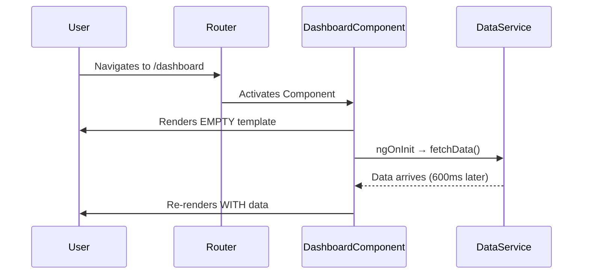
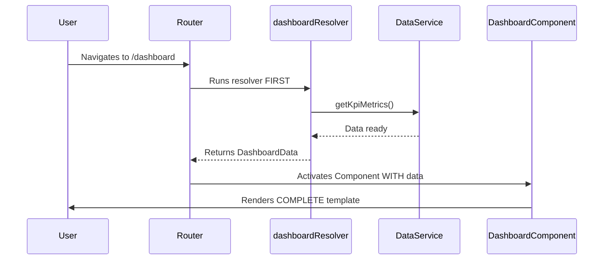

# Angular Enterprise Dashboard - Phase 3A.1: Pre-Fetching Data with Functional Resolvers


Welcome to Phase 3A — where our dashboard stops being a static shell and starts becoming _intelligent_. In Phase 2 we secured the routes and built the layout. Now we need to **fill it with data**.

<!--more-->

# Don't Make the User Wait (for Nothing)

But there's a subtle UX question every enterprise app must answer: _When_ does the data load? Before the page appears, or after?

In this post, we'll implement **Functional Resolvers** to pre-fetch dashboard data _before_ the route renders — so the user never sees an empty skeleton flash.

---

## 🧠 The Problem: The "Blank Page" Flash

Without a resolver, the typical data-loading flow looks like this:



The user sees the empty template flash. In an enterprise dashboard with KPI cards, this creates a jarring experience — cards pop in, layout shifts, numbers appear out of thin air.

**With a Resolver**, the flow becomes:



No flash. No skeleton. Just data.

---

## 🏗️ Step 1: The Data Model

Everything starts with a clear contract. We define our KPI data structures in a dedicated model file:

```typescript
// core/models/kpi.model.ts
export interface KpiMetric {
  readonly id: string;
  readonly label: string;
  readonly value: number;
  readonly unit: 'currency' | 'percent' | 'count';
  readonly trend: 'up' | 'down' | 'stable';
  readonly changePercent: number;
  readonly icon: string;
}

export interface DashboardData {
  readonly metrics: readonly KpiMetric[];
  readonly lastUpdated: Date;
}
```

**Why `readonly`?** Immutability by contract. This ensures that no component accidentally mutates the data — it must always flow through the service layer.

---

## 🏗️ Step 2: The Data Service

Next, we create a service responsible for fetching (or in our case, mocking) the data:

```typescript
// core/services/dashboard-data.service.ts
@Injectable({ providedIn: 'root' })
export class DashboardDataService {
  async getKpiMetrics(): Promise<DashboardData> {
    // Simulates a 600ms network delay
    await new Promise((resolve) => setTimeout(resolve, 600));

    return {
      metrics: MOCK_METRICS, // Revenue, Users, Conversion, Tickets
      lastUpdated: new Date(),
    };
  }
}
```

This service is intentionally simple. It returns a `Promise`, which the resolver will await. In a real production app, you would replace the mock delay with an `HttpClient` call.

---

## 🏗️ Step 3: The Functional Resolver

Now the star of the show. Instead of a class implementing `Resolve<T>`, we use a simple function typed as `ResolveFn<T>`:

```typescript
// features/dashboard/dashboard.resolver.ts
export const dashboardResolver: ResolveFn<DashboardData> = () => {
  const dataService = inject(DashboardDataService);
  return dataService.getKpiMetrics();
};
```

That's it. Three lines. The resolver:

1. Uses `inject()` to grab the data service.
2. Returns the `Promise<DashboardData>`.
3. The Router **waits** for this promise to resolve before activating the route.

---

## 🔌 Step 4: Wiring It Into the Route

The resolver is connected to the route via the `resolve` property:

```typescript
// app.routes.ts
{
  path: 'dashboard',
  loadComponent: () => import('./features/dashboard/dashboard.component')
    .then(m => m.DashboardComponent),
  resolve: { dashboardData: dashboardResolver }
}
```

The key `dashboardData` is the name that the resolved data will be available under. In the next post, we'll see how the component consumes this data using signal `input()`.

---

## 🎓 The Teaching Moment: When to Use Resolvers

Resolvers are _not_ always the right tool. Here's a quick decision guide:

| Scenario                             | Use Resolver? | Why?                       |
| ------------------------------------ | ------------- | -------------------------- |
| Critical data needed before render   | ✅ Yes        | Prevents empty state flash |
| Large dataset with loading indicator | ❌ No         | User should see progress   |
| Data that can be lazy-loaded         | ❌ No         | Use `resource()` instead   |
| Small, fast API call                 | ✅ Yes        | Invisible to the user      |

**Rule of thumb**: If the data takes less than ~1 second and the page is meaningless without it, use a resolver.

---

## Coming Up Next

We've pre-fetched the data, but how does the component receive it? In **Phase 3A.2**, we'll explore the magic of `withComponentInputBinding()` — the zero-boilerplate bridge between route data and signal inputs.

---

_Every architecture decision in this dashboard is deliberate. Explore the resolver pattern in `features/dashboard/dashboard.resolver.ts` on GitHub!_

