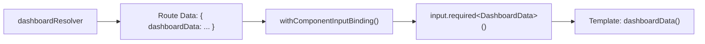

# Angular Enterprise Dashboard - Phase 3A.2: From Route to Component — Signal Inputs & the KPI Dashboard


In the [previous post](/blog/phase-03a-part-01), our resolver pre-fetched the dashboard data and handed it to the Router. But how does the _component_ actually receive it?

<!--more-->

# Zero-Boilerplate Data Binding

Traditionally, you'd inject `ActivatedRoute`, subscribe to `data`, and manually assign values. That's a lot of ceremony for something that should be simple.

In this post, we'll see how **`withComponentInputBinding()`** and **signal `input()`** create a seamless, zero-boilerplate bridge between route data and component state.

---

## 🔑 The Enabler: `withComponentInputBinding()`

This is a one-time configuration in `app.config.ts`:

```typescript
provideRouter(
  routes,
  withComponentInputBinding(), // ← This line changes everything
  withViewTransitions(),
),
```

**What it does:** It tells Angular's Router to automatically bind resolved route data, route parameters, and query parameters to component `input()` properties — by matching the key name.

---

## 🏗️ The Component: Consuming Resolved Data

Remember, our route defined the resolver with the key `dashboardData`:

```typescript
resolve: {
  dashboardData: dashboardResolver;
}
```

In our component, we simply declare a signal input with the **same name**:

```typescript
@Component({
  /* ... */
})
export class DashboardComponent {
  /** Resolved data injected automatically via withComponentInputBinding(). */
  readonly dashboardData = input.required<DashboardData>();

  // ...
}
```

That's it. No `ActivatedRoute`. No `.subscribe()`. No `ngOnInit`. The data is just _there_, ready to use — as a **Signal**.

### The Data Flow



---

## 🎨 The Template: Modern Control Flow

With the data available as a signal, our template uses Angular's modern built-in control flow — `@for` and `@switch` — instead of the legacy `*ngFor` and `*ngIf` directives.

### Iterating KPI Cards

```html
<section class="kpi-grid">
  @for (metric of dashboardData().metrics; track metric.id) {
  <article class="kpi-card" [class]="'trend-' + metric.trend">
    <!-- ... card content ... -->
  </article>
  }
</section>
```

**Why `track metric.id`?** The `track` expression tells Angular how to identify each item. When data refreshes, Angular can efficiently update only the cards that changed, instead of tearing down and re-creating the entire list.

### Formatting Values with `@switch`

Different metrics need different formatting — revenue as currency, conversion as a percentage, etc. We use `@switch` for clean, readable branching:

```html
<span class="kpi-value">
  @switch (metric.unit) { @case ('currency') { {{ metric.value |
  currency:'USD':'symbol':'1.0-0' }} } @case ('percent') { {{ metric.value |
  number:'1.2-2' }}% } @case ('count') { {{ metric.value | number }} } }
</span>
```

---

## 💎 The KPI Card: Glassmorphism in Action

Each card reuses our glassmorphism design tokens from [Phase 2.4](/blog/phase-02-part-04):

```css
.kpi-card {
  background: var(--glass-bg);
  backdrop-filter: var(--glass-blur);
  border: 1px solid var(--glass-border);
  border-radius: var(--radius-lg, 16px);
  transition:
    transform 0.2s ease,
    box-shadow 0.2s ease;
}

.kpi-card:hover {
  transform: translateY(-2px);
  box-shadow: var(--shadow-md);
}
```

And the trend colors are driven by a dynamic CSS class:

```css
.trend-up .kpi-trend {
  color: #10b981;
} /* Green */
.trend-down .kpi-trend {
  color: #ef4444;
} /* Red */
.trend-stable .kpi-trend {
  color: #94a3b8;
} /* Slate */
```

---

## 🎓 The Teaching Moment: `input()` vs `@Input()`

| Feature             | Classic `@Input()`      | Signal `input()`                             |
| ------------------- | ----------------------- | -------------------------------------------- |
| Type                | Property decorator      | Function returning `InputSignal`             |
| Reactivity          | Requires `ngOnChanges`  | Natively reactive (it's a signal!)           |
| Required values     | Requires runtime checks | `input.required()` — compile-time guarantee  |
| With Router binding | Needs `ActivatedRoute`  | Automatic with `withComponentInputBinding()` |

Signal inputs aren't just syntax sugar — they fundamentally change how data flows through your component. Because they are Signals, any `computed()` or `effect()` that depends on them will automatically react when the route data changes.

---

## Coming Up Next

Our dashboard renders with data, looks premium, and uses modern Angular patterns. But we're missing the final polish. In **Phase 3A.3**, we'll add **View Transitions** for cinematic route changes and enable **Incremental Hydration** for SSR performance.

---

_Explore the full `DashboardComponent` in `features/dashboard/dashboard.component.ts` on GitHub!_

