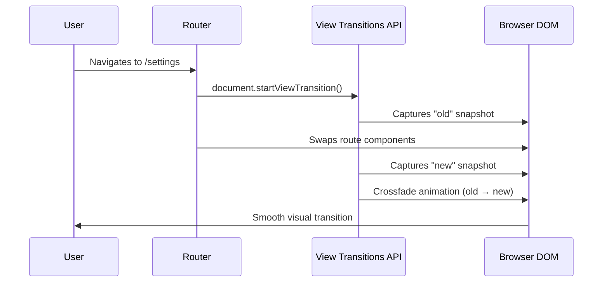
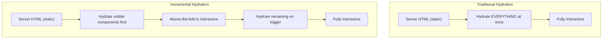

# Angular Enterprise Dashboard - Phase 3A.3: Polishing the Experience — View Transitions & Incremental Hydration


We've built the data pipeline ([Part 1](/blog/2026-03-18-phase-03a-part-01)) and the dashboard UI ([Part 2](/2026-03-18-phase-03a-part-02)). The app works. But "works" and "feels amazing" are two very different things.

<!--more-->

# The Invisible Upgrades That Make Everything Feel Premium

In this final Phase 3A post, we tackle two framework-level optimizations that elevate our application from functional to _polished_: **View Transitions** and **Incremental Hydration**.

---

## ✨ View Transitions: Cinematic Route Changes

### The Problem

By default, when a user navigates between routes, the old view instantly disappears and the new view instantly appears. It's functional, but it feels abrupt — like flipping a light switch.

### The Solution

The **View Transitions API** is a browser-native feature that Angular can hook into. It creates a smooth, animated crossfade between the outgoing and incoming route.

Enabling it is a single line:

```typescript
// app.config.ts
provideRouter(
  routes,
  withComponentInputBinding(),
  withViewTransitions(),   // ← This is all you need
),
```

### How It Works Under the Hood



**The Teaching Moment:** You get this for free. No custom animations, no third-party libraries, no `@angular/animations`. The browser handles the visual interpolation natively, which means it's GPU-accelerated and buttery smooth.

### Customizing with CSS

You can style the transition using the `::view-transition-old` and `::view-transition-new` pseudo-elements:

```css
::view-transition-old(root) {
  animation: fade-out 0.2s ease-out;
}

::view-transition-new(root) {
  animation: fade-in 0.3s ease-in;
}
```

---

## 🧊 Incremental Hydration: SSR, Evolved

### What Changed

In Phase 1, our `app.config.ts` used `withEventReplay()` — a basic SSR hydration strategy. In Phase 3A, we upgraded to:

```typescript
provideClientHydration(
  withIncrementalHydration(), // Replaces withEventReplay()
),
```

### What is Hydration?

When using Server-Side Rendering (SSR) or Static Site Generation (SSG), the server sends fully rendered HTML to the browser. But that HTML is "dead" — it has no event listeners, no interactivity. **Hydration** is the process of making it alive.

### The Evolution



### Why It Matters

In a dashboard with many widgets (KPI cards, charts, tables, notifications), traditional hydration would hydrate _everything_ at once — even components the user hasn't scrolled to yet. This blocks the main thread and delays Time-to-Interactive (TTI).

**Incremental Hydration** defers the hydration of off-screen or low-priority components until they are actually needed. It works hand-in-hand with `@defer` blocks:

```html
@defer (on viewport; hydrate on viewport) {
<app-heavy-chart-widget />
} @placeholder {
<div class="chart-skeleton">Loading chart...</div>
}
```

The component's HTML exists in the server-rendered output, but it only becomes interactive when the user scrolls it into view.

---

## 📐 The Full `app.config.ts` at Phase 3A

Here's the complete configuration after all Phase 3A upgrades:

```typescript
export const appConfig: ApplicationConfig = {
  providers: [
    provideZonelessChangeDetection(), // Phase 1
    provideRouter(
      routes,
      withComponentInputBinding(), // Phase 3A — NEW
      withViewTransitions(), // Phase 3A — NEW
    ),
    provideClientHydration(
      withIncrementalHydration(), // Phase 3A — UPGRADED
    ),
    provideHttpClient(withInterceptors([authInterceptor, loggingInterceptor])),
    // ...DI providers (Phase 1)
    { provide: ErrorHandler, useClass: GlobalErrorHandler },
  ],
};
```

---

## 🎓 The Teaching Moment: Configuration as Documentation

Notice how our `app.config.ts` tells a story. Each provider, each `with*()` function, is a deliberate architectural decision. By reading this single file, a new developer on the team can understand:

- We don't use Zone.js.
- Our routes bind data directly to component inputs.
- Our navigation transitions are animated.
- Our SSR uses incremental hydration.

This is **Configuration as Documentation** — and it's one of the hallmarks of enterprise-grade Angular.

---

## 🏁 Phase 3A Complete!

Let's recap what we accomplished:

| Post                              | Feature                      | Impact                                  |
| --------------------------------- | ---------------------------- | --------------------------------------- |
| [Part 1](/2026-03-18-phase-03a-part-01) | Functional Resolvers         | Data is ready before the route renders  |
| [Part 2](/2026-03-18-phase-03a-part-02) | Signal Input Binding         | Zero-boilerplate route data consumption |
| Part 3 (this post)                | View Transitions + Hydration | Cinematic UX and SSR performance        |

**Next up:** Phase 3B, where we deep-dive into Angular's `resource()` API for reactive, cancelable data fetching.

---

_Curious about how these features interact? The beauty is in the `app.config.ts` — one file, three lines, three massive UX improvements. Check it out on GitHub!_

