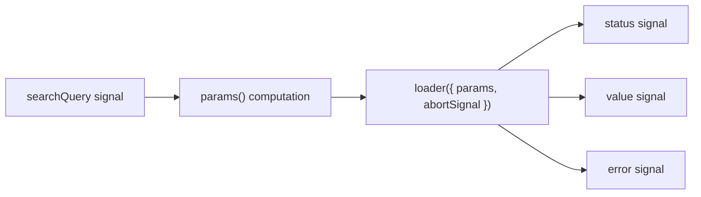

# Angular Enterprise Dashboard - Phase 3B.1: Taming Async — Core resource() Mechanics


Welcome to Phase 3B — the deepest technical dive in our series so far. In Phase 3A, we pre-fetched data using resolvers. But resolvers are a _routing_ tool. What about data that depends on user interaction — a search query, a filter, a date picker?

<!--more-->

# A New Primitive for Async Data

This is where Angular's **`resource()`** API enters the picture. It's a low-level, framework-agnostic async primitive that gives you full control over the data lifecycle.

In this first post, we'll lay the groundwork: the data model, the API service, and the core `resource()` declaration.

---

## 🧠 What is `resource()`?

Think of `resource()` as a **reactive async container**. You give it:

1. A **`params`** computation — a reactive expression that returns the request parameters.
2. A **`loader`** function — an async function that fetches the data.

Whenever `params` changes (because a signal it depends on changed), the resource automatically re-invokes the loader. It tracks status, exposes the value, and handles errors — all as Signals.



---

## 🏗️ Step 1: The Domain Model

We define a `Project` entity and a `ProjectSearchParams` type:

```typescript
// features/projects/models/project.model.ts
export type ProjectStatus = 'active' | 'completed' | 'on-hold' | 'archived';

export interface Project {
  readonly id: string;
  readonly name: string;
  readonly description: string;
  readonly status: ProjectStatus;
  readonly progress: number;
  readonly owner: string;
  readonly updatedAt: Date;
}

export interface ProjectSearchParams {
  readonly query: string;
}
```

**Why a separate `ProjectSearchParams`?** It makes the `resource()` params computation strongly typed. The loader knows exactly what shape to expect.

---

## 🏗️ Step 2: The API Service

Our `ProjectApiService` simulates a real backend with network latency. Crucially, it accepts an optional `AbortSignal` — we'll see why in the next post.

```typescript
@Injectable({ providedIn: 'root' })
export class ProjectApiService {
  async searchProjects(
    query: string,
    abortSignal?: AbortSignal,
  ): Promise<readonly Project[]> {
    await this.delay(400, abortSignal); // Simulated latency

    const lowerQuery = query.toLowerCase();
    return MOCK_PROJECTS.filter(
      (p) =>
        p.name.toLowerCase().includes(lowerQuery) ||
        p.description.toLowerCase().includes(lowerQuery),
    );
  }

  private delay(ms: number, abortSignal?: AbortSignal): Promise<void> {
    return new Promise((resolve, reject) => {
      const timer = setTimeout(resolve, ms);
      abortSignal?.addEventListener('abort', () => {
        clearTimeout(timer);
        reject(new DOMException('Request aborted', 'AbortError'));
      });
    });
  }
}
```

**Key insight:** The `delay()` helper properly respects `AbortSignal`. When the signal fires, it clears the timer and rejects with a standard `AbortError`. This is exactly how `fetch()` behaves natively.

---

## 🏗️ Step 3: Declaring the Resource

Here's the core `resource()` declaration inside our `ProjectsComponent`:

```typescript
export class ProjectsComponent {
  private readonly projectApi = inject(ProjectApiService);

  /** The search query — a simple writable signal. */
  readonly searchQuery = signal('');

  /** The resource: reactive params + async loader. */
  readonly projectsResource = resource({
    params: () => {
      const query = this.searchQuery();
      return query.length > 0 ? { query } : undefined;
    },

    loader: async ({ params, abortSignal, previous }) => {
      return this.projectApi.searchProjects(params.query, abortSignal);
    },
  });
}
```

### Breaking It Down

| Part                                      | What It Does                                                                                                                |
| ----------------------------------------- | --------------------------------------------------------------------------------------------------------------------------- |
| `params: () => ...`                       | A reactive computation. Whenever `searchQuery` changes, this re-evaluates.                                                  |
| `return undefined`                        | When the query is empty, returning `undefined` puts the resource into `'idle'` state — **no fetch happens**.                |
| `loader: async ({ params, abortSignal })` | Called when `params` returns a non-undefined value. Receives the resolved params, an abort signal, and the previous status. |

---

## 🎓 The Teaching Moment: `resource()` vs. Manual Patterns

Without `resource()`, you'd typically write something like:

```typescript
// The OLD way — fragile, manual, and error-prone
ngOnInit() {
  this.searchQuery$.pipe(
    debounceTime(300),
    switchMap(q => this.api.search(q)),
    takeUntilDestroyed(),
  ).subscribe(data => this.projects = data);
}
```

With `resource()`, you get:

- ✅ Automatic cancellation (no `switchMap` needed)
- ✅ Status tracking (no manual `isLoading` boolean)
- ✅ Signal-native (no `.subscribe()`, no memory leak risk)
- ✅ Typed params and value

---

## Coming Up Next

We've declared the resource, but we haven't talked about what happens when the user types _fast_. In **Phase 3B.2**, we'll dive into the **abort and cancellation** patterns that make search-as-you-type smooth and efficient.

---

_This is the beginning of a deep dive. The full `ProjectsComponent` is a 300+ line showcase of `resource()`. Explore it on GitHub!_

