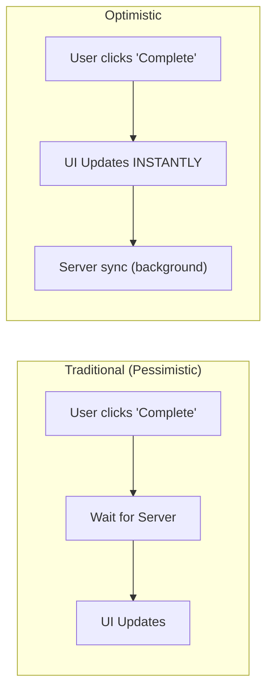
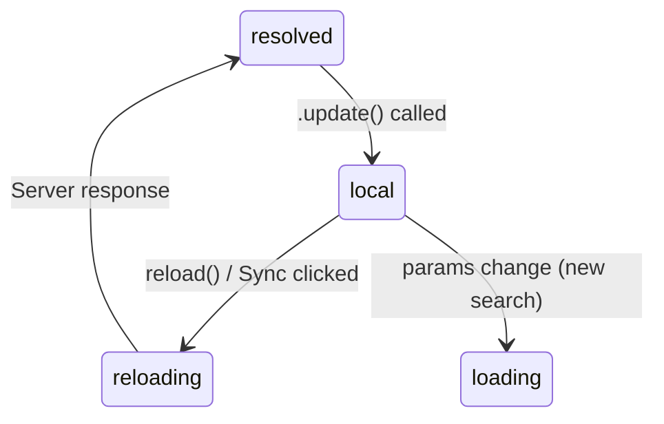

# Angular Enterprise Dashboard - Phase 3B.4: Optimistic Updates — Local Mutations Without Re-Fetching


We've explored how `resource()` handles [loading](/2026-03-18-phase-03b-part-01), [cancellation](/2026-03-18-phase-03b-part-02), and [all six status states](/2026-03-18-phase-03b-part-03). But there's one pattern left that separates a good app from a great one: **optimistic updates**.

<!--more-->

# Making the UI Respond Instantly

When a user clicks "Mark Complete" on a project, they don't want to wait 400ms for a server round-trip to see the change. They want it _now_.

---

## 🧠 The Concept: Optimistic UI

An optimistic update modifies the local data immediately — before the server confirms it. The UI reacts instantly, and the server sync happens in the background.



The trade-off: if the server rejects the change, you need to roll back. But for many operations (toggling status, incrementing counts, marking items), the success rate is so high that optimistic updates dramatically improve perceived speed.

---

## 🛠️ Implementation: `.update()`

Our `ProjectsComponent` has a "Mark Complete" button on each card. Here's the handler:

```typescript
markComplete(project: Project): void {
  this.projectsResource.update(current => {
    if (!current) return current;
    return current.map(p =>
      p.id === project.id
        ? { ...p, status: 'completed' as const, progress: 100 }
        : p,
    );
  });
}
```

### What's Happening

1. `.update()` receives the current resource value (the project array).
2. We return a **new array** with the target project's status changed to `'completed'` and progress set to `100`.
3. The resource's `value()` signal updates immediately.
4. The resource's `status()` transitions to `'local'`.
5. **No server request is made.**

---

## 🟡 The `'local'` Status

After an `.update()` call, the resource enters the `'local'` status. This is Angular's way of saying: _"The data you're seeing has been modified locally and may not match the server."_

We show a visual notice to make this transparent:

```html
@if (projectsResource.status() === 'local') {
<div class="local-notice">
  ⚡ Local update — data has not been re-fetched from the server.
  <button class="btn btn-sm" (click)="handleReload()">Sync</button>
</div>
}
```

The "Sync" button calls `reload()`, which re-fetches from the server and transitions back to `resolved`.

### The State Flow



---

## 🎨 Styling the `'local'` State

The local notice uses a warm amber palette to indicate "something is different":

```css
.local-notice {
  display: flex;
  align-items: center;
  gap: 0.75rem;
  margin-top: 1rem;
  padding: 0.75rem 1rem;
  border-radius: var(--radius-md, 12px);
  background: #fef3c7;
  color: #92400e;
  font-size: 0.85rem;
  font-weight: 500;
}
```

And the status badge automatically turns amber:

```css
.status-local {
  background: #fef3c7;
  color: #d97706;
}
```

---

## 🎓 The Teaching Moment: `.update()` vs. `.set()` vs. `reload()`

| Method        | What It Does                              | Status After  |
| ------------- | ----------------------------------------- | ------------- |
| `.update(fn)` | Transforms current value with a function  | `'local'`     |
| `.set(val)`   | Replaces current value directly           | `'local'`     |
| `.reload()`   | Re-invokes the loader with current params | `'reloading'` |

**When to use which:**

- **`.update()`**: When you know exactly what changed (e.g., toggling a boolean, incrementing a counter).
- **`.set()`**: When you have a completely new value from another source.
- **`.reload()`**: When you want the server's truth (e.g., after a mutation, or for "pull-to-refresh").

---

## 🏁 Phase 3B Complete!

Let's recap the entire `resource()` deep dive:

| Post                                    | Feature              | Key Concept                     |
| --------------------------------------- | -------------------- | ------------------------------- |
| [Part 1](/2026-03-18-phase-03b-part-01) | Core Mechanics       | `params` + `loader` declaration |
| [Part 2](/2026-03-18-phase-03b-part-02) | Abort & Cancellation | `abortSignal` + `idle` state    |
| [Part 3](/2026-03-18-phase-03b-part-03) | Status-Driven UI     | 6 states, skeletons, `reload()` |
| Part 4 (this post)                      | Optimistic Updates   | `.update()`, `'local'` status   |

The `resource()` API is one of Angular's most powerful new primitives. It replaces manual subscriptions, switchMaps, loading flags, and error handling with a single, declarative declaration.

**Next up:** Phase 3C, where we explore `httpResource()` — the HTTP-specific layer that integrates with interceptors, provides response parsing, and handles different content types.

---

_The full `ProjectsComponent` at this point is 328 lines of code — and every line teaches something. Explore it in `features/projects/containers/projects.component.ts` on GitHub!_

